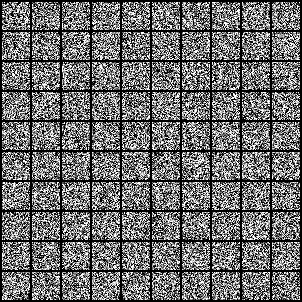
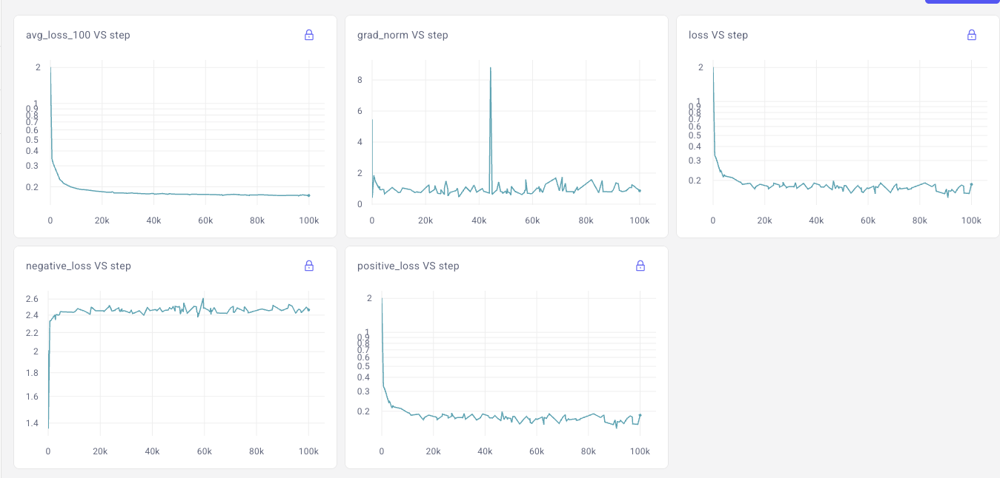
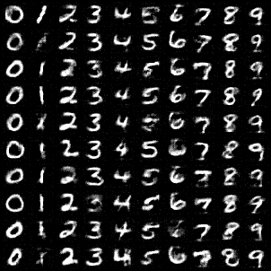
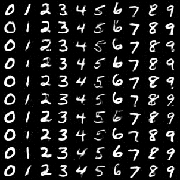
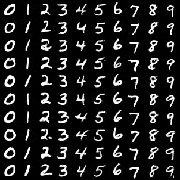
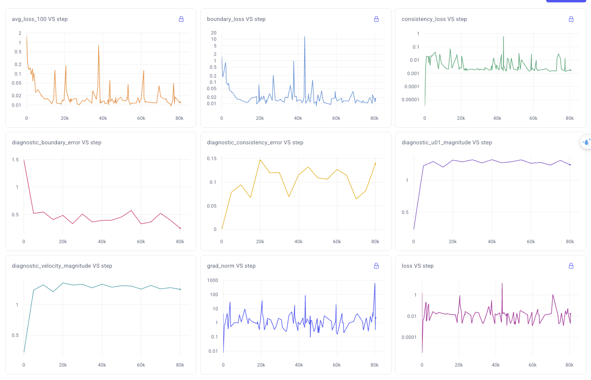

# SplitMeanFlow - Unofficial Implementation


This is an **unofficial implementation** of SplitMeanFlow from the paper **"SplitMeanFlow: Interval Splitting Consistency in Few-Step Generative Modeling"** by ByteDance. [[arxiv](https://arxiv.org/abs/2507.16884)]. This implementation is based on my understanding of the paper and uses the DiT architecture as the backbone.

**Note: This is not the official implementation. For the official code, please refer to the authors' repository when it becomes available.**

## Overview

SplitMeanFlow introduces a novel approach for few-step generation by learning average velocity fields through an algebraic consistency principle. The key innovation is avoiding expensive Jacobian-Vector Product (JVP) computations while achieving one-step generation quality comparable to traditional multi-step methods.

## Setup

Create the conda environment:
```bash
conda env create -f environment.yml
conda activate splitmeanflow
```


## Training

### MNIST dataset

#### Stage 1: Teacher Model
First, train a standard flow matching teacher:
```bash
python train_teacher_mnist.py
```

Samples in training:



The training log here: 

You can download the teacher model at [model](https://github.com/primepake/splitmeanflow/releases/tag/mnist)

#### Stage 2: Student Model  
Then train the SplitMeanFlow student:
```bash
python train_student_mist.py
```

Samples in training:

### 1st Step <br/>


### 2st Step <br/>


### 4st Step <br/>


The training log here: 


### CIFAR10 dataset

#### Stage 1: Teacher Model
First, train a standard flow matching teacher:
```bash
python train_teacher.py
```

Samples in training:


The training log here: 

You can download the teacher model at [model](https://github.com/primepake/splitmeanflow/releases/tag/cifar10)

#### Stage 2: Student Model  
Then train the SplitMeanFlow student:
```bash
python train_student.py
```

Samples in training:

### 1st Step <br/>


### 2st Step <br/>


### 4st Step <br/>


The training log here: 


The training follows Algorithm 1 from the paper with some modifications based on my interpretation.

## Experimental Results
- [x] Trained MNIST dataset 
- [x] Trained CIFAR10 dataset


**Disclaimer: These are preliminary results from my implementation and may not match the paper's performance.**


## Known Issues & Differences from Paper

1. **Performance Gap**: My implementation doesn't quite reach the paper's reported metrics
2. **Training Stability**: Occasionally encounter NaN losses - added gradient clipping as workaround
3. **CFG Handling**: My interpretation of CFG-free training might differ from the official approach
4. **Time Sampling**: Using uniform sampling instead of log-normal as mentioned in paper


## Contributing

This is an unofficial implementation created for learning purposes. If you find any bugs or have suggestions for improvements, please open an issue or submit a PR. If you have insights about the paper or the official implementation, I'd love to hear them!

## Citation

Please cite the original paper:
```bibtex
@article{guo2025splitmeanflow,
  title={SplitMeanFlow: Interval Splitting Consistency in Few-Step Generative Modeling},
  author={Guo, Yi and Wang, Wei and Yuan, Zhihang and others},
  journal={arXiv preprint arXiv:2507.16884},
  year={2025}
}
```

## Acknowledgments

- Original paper by ByteDance Seed team
- DiT implementation adapted from [facebookresearch/DiT](https://github.com/facebookresearch/DiT)
- Thanks to the authors for the clear paper and algorithm descriptions

## License

This unofficial implementation is released under MIT License. Please refer to the original paper and official implementation for any commercial use.